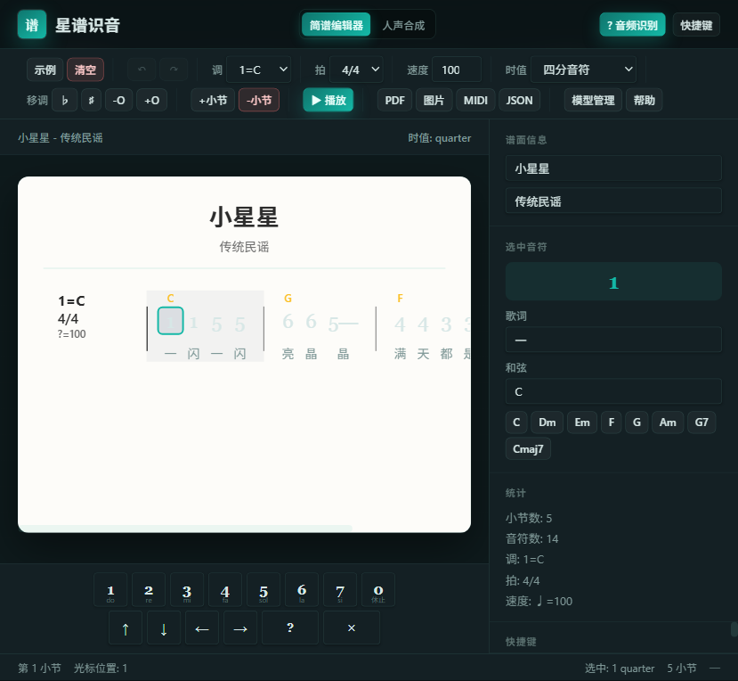
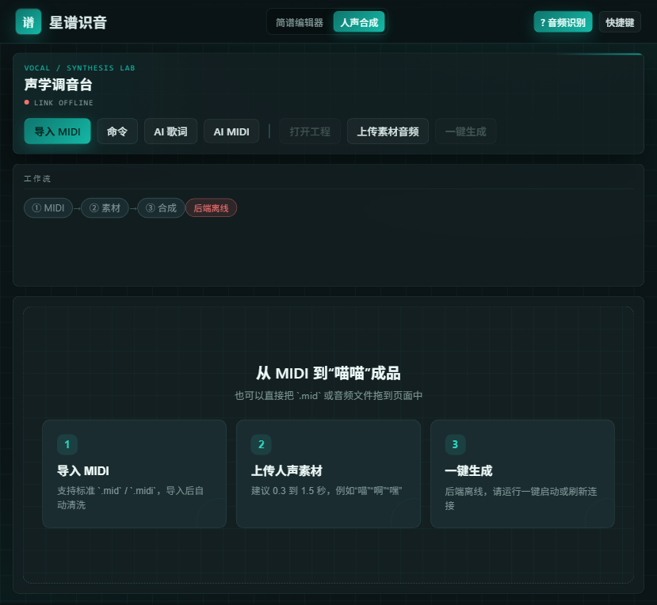

# 星谱识音 · StarScore

> 从音频到简谱，从 MIDI 到人声合成 —— 一个跑在浏览器里的音乐工作台。

星谱识音是一个本地优先（local-first）的音乐工具集，包含两个视图：

- **简谱编辑器**：上传/播放音频 → 自动识别音高、节拍、调号 → 生成可编辑的编号简谱（1 2 3 4 5 6 7），支持歌词、和弦、导出 MIDI/PDF/图片。
- **人声合成**：导入 MIDI + 上传一段短人声音色（如"喵""啊""嘿"）→ 后端切片、绑定、渲染 → 合成出整段演唱音频。内置 AI 歌词识别与 Prompt 生成 MIDI。





---

## ✨ 功能

### 简谱编辑器
- 纯浏览器端音频识别：自实现 FFT / YIN 基频检测、谱通量节拍估计、Krumhansl-Schmuckler 调号识别
- 可编辑编号简谱：和弦标记、歌词、附点、升降八度、移调
- 撤销/重做、命令面板（Ctrl+K）、LocalStorage 自动保存
- 导出 JSON / MIDI / PDF / PNG
- 人声/伴奏分离（可选，需后端）：中置声道提取，或可选 Demucs AI 分离

### 人声合成
- 导入标准 `.mid` / `.midi`，自动清洗
- 上传 0.3–1.5 秒人声音色样本，切片绑定到音符
- Python 后端实时渲染合成音频（纯标准库起步，零 pip 依赖）
- 可取消的异步任务队列，工程保存/打开
- AI 歌词识别、Prompt 生成 MIDI（OpenAI 兼容接口）
- 暗色仪器控制台风格 UI

---

## 🛠 技术栈

| 层 | 技术 |
|---|---|
| 前端 | React 19 · TypeScript · Vite 8 · Canvas · Web Audio API |
| 音频识别 | 自实现 FFT / YIN · 谱通量 onset · 自相关节拍 · 调性轮廓匹配 |
| 后端 | Python 标准库（HTTP 服务 + 任务队列），可选 Demucs |
| 数据 | LocalStorage · `.vproj` 工程文件 · MIDI 解析/导出 |

---

## 🚀 快速启动

### 前端

```bash
cd star-score
npm install
npm run dev        # http://localhost:5173
```

构建生产版：

```bash
npm run build
```

Windows 用户可直接双击 `star-score/启动-开发模式.bat`。

### 后端（人声合成 / 音频分离功能需要）

```bash
cd star-score
py backend/server.py
```

后端是纯 Python 标准库，**不需要 pip install**。双击 `backend/启动后端.bat` 亦可。

> 仅用简谱识别与编辑时，不开后端也能跑。

---

## 📁 仓库结构

```
new-chat/
├─ star-score/                  # 主应用（React + Python 后端）
│  ├─ src/
│  │  ├─ core/                  # 纯逻辑：音频识别 / MIDI / 播放引擎 / 合成
│  │  ├─ components/            # UI 组件（简谱编辑器 + 人声合成工作台）
│  │  ├─ features/              # 命令面板、AI 集成等功能编排
│  │  ├─ hooks/                 # 谱面状态、撤销重做
│  │  └─ styles/                # 暗色实验室主题
│  ├─ backend/                  # Python 后端（HTTP + 任务队列）
│  ├─ docs/                     # 架构与进度文档
│  └─ tests/
├─ human_vocal_workbench/        # .vproj / MIDI / 切片 / 渲染的契约参考实现
├─ docs/screenshots/             # README 截图
├─ AGENTS.md                     # 贡献者开发约定
└─ 核心契约 v0.3.2.md            # 工程文件与模块间契约
```

---

## 🗺 Roadmap

- [x] M1 简谱编辑器（识别、编辑、导出）
- [x] M2 播放引擎与撤销重做
- [x] M3a/M3c/M3d 人声合成工作台（MIDI 导入、切片绑定、渲染）
- [x] AI 歌词识别与 Prompt → MIDI
- [ ] M3b 强制对齐（HubertFA）
- [ ] M4 导出 USTX / VSQX / MusicXML
- [ ] M5 AI 助手深度集成
- [ ] M6 桌面端打包

详见 `star-score/docs/HUMANV_PROGRESS.md`。

---

## 📜 License

[MIT](LICENSE) © Luckxiaobai

本项目使用了第三方开源组件与预训练模型（含 [openvpi/GAME](https://github.com/openvpi/GAME) 的 ONNX 歌声转写模型、@spotify/basic-pitch 等，均为 MIT / Apache-2.0 / BSD 宽松协议）。完整版权声明见 [THIRD_PARTY_NOTICES.md](THIRD_PARTY_NOTICES.md)。
